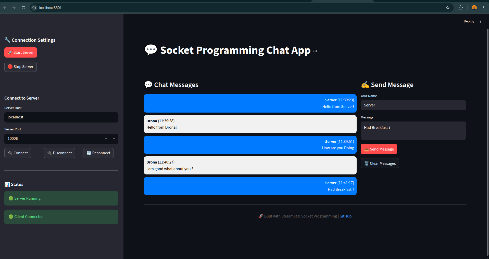
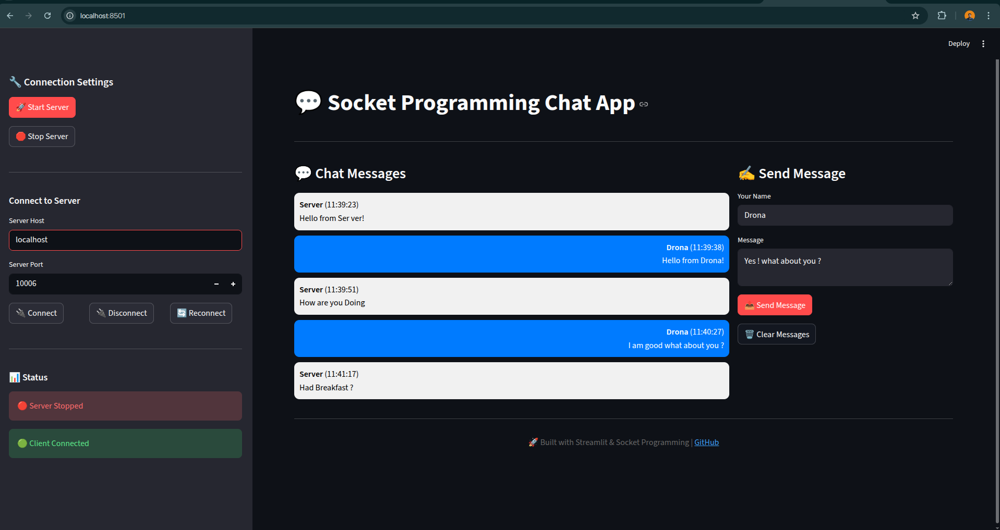

# 💬 Socket Programming Chat App

A real-time chat application built with **Streamlit** and **Python Socket Programming**. This application demonstrates client-server communication using TCP sockets, allowing multiple users to chat in real-time.

## 🚀 Features

- **Real-time Communication**: Instant message delivery using socket programming
- **Client-Server Architecture**: Robust TCP socket-based communication
- **Modern UI**: Beautiful Streamlit interface with responsive design
- **Multi-threading**: Non-blocking message handling
- **Connection Management**: Easy server start/stop and client connect/disconnect
- **Message History**: View all sent and received messages
- **Status Indicators**: Real-time connection status monitoring
- **Cross-platform**: Works on Windows, macOS, and Linux

## 🛠️ Technical Stack

- **Frontend**: Streamlit
- **Backend**: Python Socket Programming
- **Protocol**: TCP/IP
- **Threading**: Python threading module
- **Data Format**: JSON for message serialization

## 📋 Prerequisites

Before running this application, make sure you have:

- Python 3.7 or higher
- pip (Python package installer)
- A modern web browser
- Network connectivity (for multi-device testing)

## 🔧 Installation

### Step 1: Clone the Repository
```bash
git clone <repository-url>
cd Dronanaik-build-a-chat-app-socket-programming
```

### Step 2: Install Dependencies
```bash
pip install -r requirements.txt
```

### Step 3: Run the Application
```bash
streamlit run main.py
```

The application will open in your default web browser at `http://localhost:8501`

## 🎯 How to Use

### Starting a Chat Server

1. **Open the Application**: Launch the Streamlit app using `streamlit run main.py`
2. **Start Server**: Click the "🚀 Start Server" button in the sidebar
3. **Verify Status**: Check that the status shows "🟢 Server Running"
4. **Server is Ready**: Your chat server is now listening for connections

### Connecting as a Client

1. **Enter Server Details**: 
   - Server Host: `localhost` (for local testing)
   - Server Port: `12345` (default port)
2. **Connect**: Click the "🔌 Connect" button
3. **Verify Connection**: Status should show "🟢 Client Connected"
4. **Start Chatting**: Enter your name and start sending messages!

### Sending Messages

1. **Enter Your Name**: Type your display name in the "Your Name" field
2. **Type Message**: Write your message in the text area
3. **Send**: Click "📤 Send Message" to send your message
4. **View Messages**: All messages appear in the chat area with timestamps

### Multi-User Setup

To test with multiple users:

1. **Run Server**: Start the server on one machine/terminal
2. **Multiple Clients**: Open the app in different browsers or on different machines
3. **Connect Clients**: Each client connects to the same server
4. **Chat**: All connected clients can see each other's messages

## 🏗️ Architecture Overview

### Socket Programming Implementation

The application uses Python's `socket` module to create a TCP-based chat system:

```python
# Server Socket Creation
self.socket = socket.socket(socket.AF_INET, socket.SOCK_STREAM)
self.socket.bind((self.host, self.port))
self.socket.listen(1)

# Client Socket Connection
self.client_socket = socket.socket(socket.AF_INET, socket.SOCK_STREAM)
self.client_socket.connect((server_host, server_port))
```

### Key Components

1. **ChatApp Class**: Main application logic
   - `start_server()`: Initializes and starts the TCP server
   - `connect_to_server()`: Establishes client connection
   - `send_message()`: Sends messages via socket
   - `handle_client()`: Processes incoming messages

2. **Threading**: Non-blocking operations
   - Server thread for accepting connections
   - Client thread for receiving messages
   - UI remains responsive during network operations

3. **Message Format**: JSON-based communication
   ```json
   {
     "id": "unique-message-id",
     "text": "message content",
     "sender": "sender name",
     "timestamp": "HH:MM:SS",
     "type": "sent/received"
   }
   ```

## 🔧 Configuration

### Default Settings
- **Host**: localhost
- **Port**: 12345
- **Protocol**: TCP
- **Encoding**: UTF-8

### Customization
You can modify these settings in the `main.py` file:

```python
class ChatApp:
    def __init__(self):
        self.host = "localhost"  # Change to your IP for network access
        self.port = 12345         # Change to any available port
```

## 🐛 Troubleshooting

### Common Issues

1. **"Address already in use" Error**
   - **Solution**: Change the port number or stop other applications using the same port

2. **Connection Refused**
   - **Solution**: Ensure the server is running before connecting clients

3. **Messages Not Appearing**
   - **Solution**: Check connection status and refresh the page

4. **Port Access Issues**
   - **Solution**: For network access, change `localhost` to your machine's IP address

### Debug Mode
Enable debug information by adding print statements in the code:

```python
print(f"Debug: {message_data}")  # Add this line in message handling functions
```

## 🌐 Network Testing

### Local Testing
- Run server and client on the same machine
- Use `localhost` as the server host

### Network Testing
- Run server on one machine
- Use the server machine's IP address as host
- Ensure firewall allows the port

### Port Forwarding (for internet access)
- Configure router port forwarding
- Use your public IP address
- **Security Note**: Only do this in secure environments

## 📊 Performance Considerations

- **Message Size**: Keep messages under 1024 bytes for optimal performance
- **Concurrent Users**: The current implementation supports one client per server
- **Memory Usage**: Messages are stored in memory (consider database for production)
- **Network Latency**: Real-time performance depends on network conditions

## 🔒 Security Notes

- **No Authentication**: This is a demo application without user authentication
- **No Encryption**: Messages are sent in plain text
- **Local Network Only**: Default configuration is for local testing
- **Production Use**: Add authentication, encryption, and proper error handling

## 🚀 Future Enhancements

### Planned Features
- [ ] Multiple client support
- [ ] Message encryption
- [ ] User authentication
- [ ] File sharing
- [ ] Message persistence
- [ ] Chat rooms
- [ ] Emoji support
- [ ] Message search

### Code Improvements
- [ ] Database integration
- [ ] Error handling improvements
- [ ] Logging system
- [ ] Unit tests
- [ ] Docker containerization

---
## Demo Screenshot
- **Socket Programming Chat App Interface - Server**


---
- **Socket Programming Chat App Interface - Client**

---

**Happy Chatting! 💬✨**

*Built with ❤️ using Streamlit and Socket Programming*
